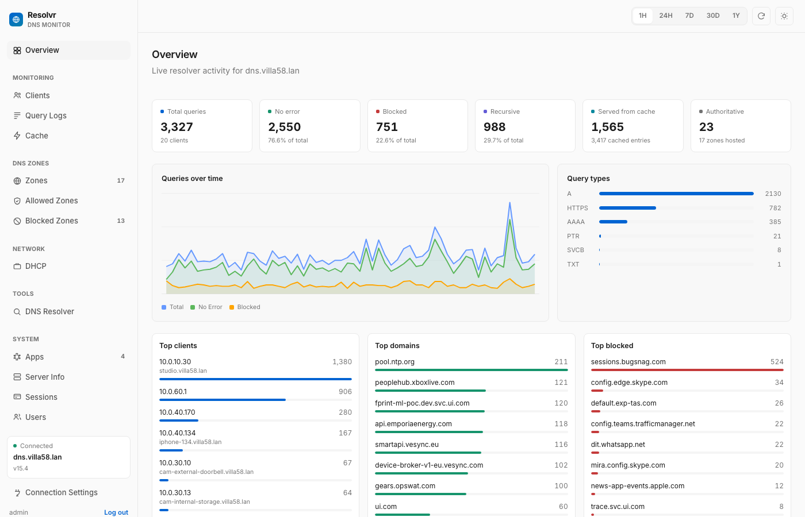
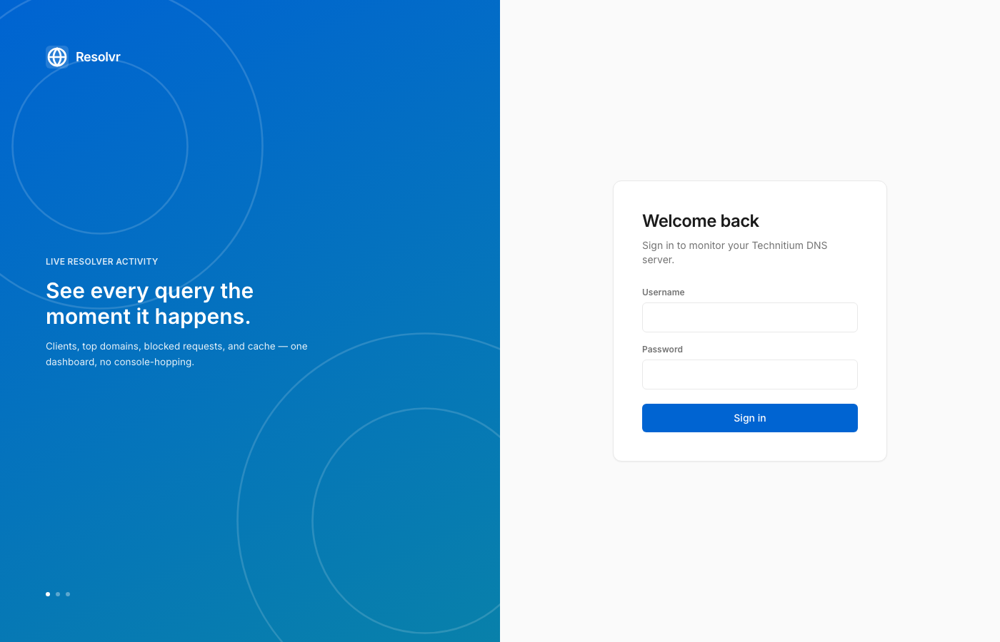
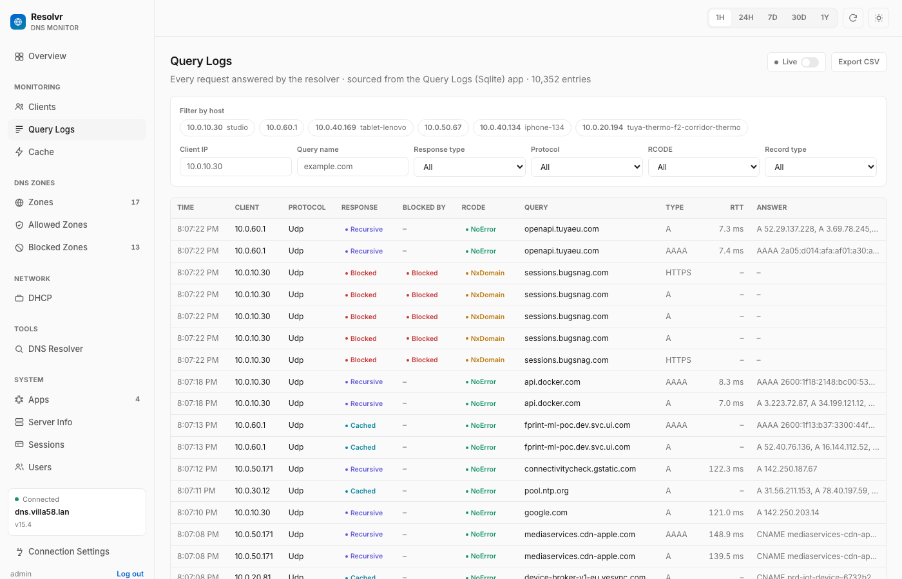
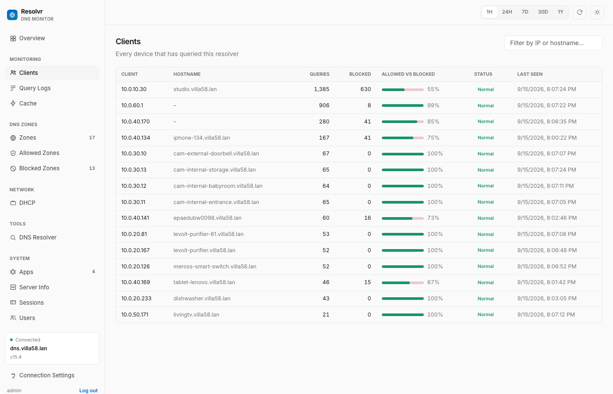
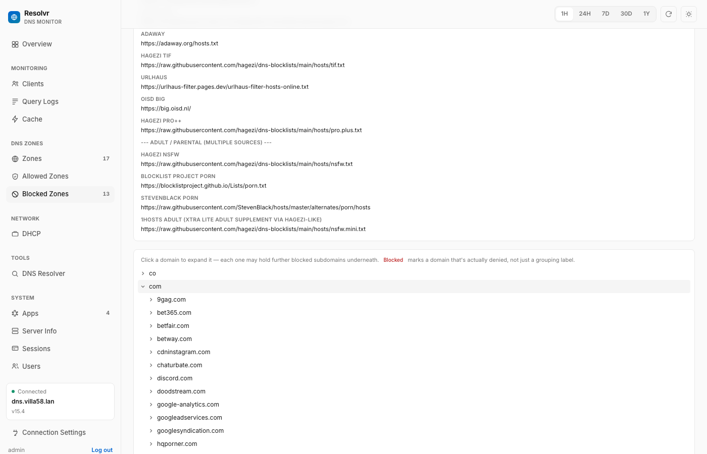
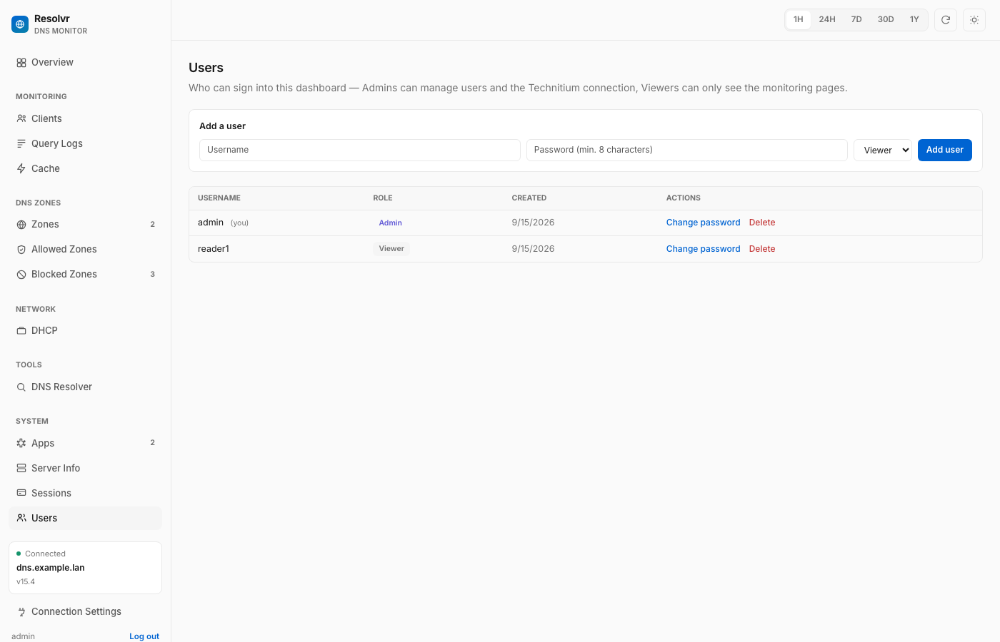

# Resolvr

A monitoring dashboard for [Technitium DNS Server](https://technitium.com/dns/) — live query traffic, clients, cache, zones, DHCP, and blocking, with its own login and role-based access, built for people who run a home or small-office DNS resolver and want a clean view into what it's doing without living in Technitium's own admin console.

`dns` · `technitium` · `dns-server` · `dashboard` · `self-hosted` · `homelab` · `monitoring` · `dns-monitoring` · `ad-blocking` · `vue3` · `typescript` · `docker` · `sqlite` · `express`



## What it does

- **Live monitoring** — query volume over time, query types, top clients, top domains, top blocked domains, cache contents, DHCP leases and zones, all read from your Technitium server.
- **Query Logs** with real filtering — client IP, query name, response type, protocol, RCODE, record type — plus a per-host "allowed vs. blocked" breakdown and a live-tail toggle.
- **Blocked Zones as an actual tree**, not a flat list — Technitium's blocked-zone API is a tree browser, so Resolvr lazily expands it instead of showing only the misleading top-level labels.
- **Block list sources** — see and edit the feed URLs your server subscribes to, in one place.
- **Its own users and roles** — Admins can manage users, edit the Technitium connection, and use the handful of mutating actions below; Viewers get full read access to every monitoring page and nothing else.
- **A few deliberate, narrow admin actions** on top of an otherwise strictly read-only design: flush the DNS cache, force a block-list update, add/remove a blocked domain, edit block list source URLs, and revoke a stale session. Each one is a single hardcoded call to a specific Technitium endpoint, gated to the admin role, and confirmed before it runs — never a general write proxy.

Resolvr never edits DNS zone records, and never touches anything on your DNS server beyond that short, explicit list of admin actions — every other page only reads.

## Screenshots

| | |
|---|---|
|  |  |
|  |  |
|  | |

## Architecture

Two small services:

- **`backend/`** — a stateless Node/Express proxy in front of Technitium's HTTP API (Technitium sends no CORS headers, so the browser can't call it directly), plus a small SQLite database (`better-sqlite3`) holding Resolvr's own users, sessions, and the shared Technitium connection config. The proxy only forwards `GET` requests on a hardcoded allowlist of read endpoints — nothing else gets through, regardless of what a client sends.
- **`frontend/`** — a Vue 3 + TypeScript + Vite SPA, served as static files in production.

```
Browser → frontend (static SPA) → backend (Express) → Technitium DNS Server
```

## Deploying

### Option 1: Docker (recommended)

This is the fastest path to a running instance — one command builds both services and gets you a persistent SQLite volume for users/config.

**Requirements:** Docker and Docker Compose.

```bash
cd technitium-dashboard   # this repo
docker compose -f docker/docker-compose.yml up -d --build
```

Then open **http://localhost:8080** and sign in with one of the seeded accounts below (see [Configuration](#configuration) — **change these passwords immediately** from the Users page).

To stop it: `docker compose -f docker/docker-compose.yml down` (add `-v` only if you also want to delete the persisted database).

#### Docker environment variables

Set these under the `backend` service in `docker/docker-compose.yml` before deploying anywhere beyond your own machine:

| Variable | Default | Purpose |
|---|---|---|
| `ADMIN_USERNAME` | `admin` | Seeded as the first admin account on first boot only. |
| `ADMIN_PASSWORD` | `change-me-on-first-login` | **Change this.** Only used the very first time the database is empty — changing it later has no effect on an existing install; change the password from the Users page instead. |
| `VIEWER_USERNAME` | `viewer` | Optional — seeded as a read-only account alongside the admin above, on first boot only. Remove both `VIEWER_*` variables if you don't want one created. |
| `VIEWER_PASSWORD` | `change-me-on-first-login` | **Change this too**, same first-boot-only caveat as `ADMIN_PASSWORD`. |
| `FRONTEND_ORIGIN` | `http://localhost:8080` | Must match wherever the frontend is actually reachable from a browser — the backend's CORS check compares against this exactly. |
| `DB_PATH` | `/app/data/resolvr.db` | Where the SQLite file lives, on the `resolvr-data` named volume so it survives rebuilds. |

The frontend image also takes a build argument, `VITE_BACKEND_URL` (default `http://localhost:8787`) — it has to be the backend's URL as seen from the *browser*, not from inside the frontend container, since Vite bakes it into the static build at build time.

### Option 2: Standalone (without Docker)

Useful for local development, or if you'd rather run the two services with your own process manager (systemd, pm2, etc.) than with Docker.

**Requirements:** Node.js 24+.

**1. Backend**

```bash
cd backend
npm install
npm run build
PORT=8787 \
FRONTEND_ORIGIN=http://localhost:5173 \
ADMIN_USERNAME=admin \
ADMIN_PASSWORD=change-me-on-first-login \
VIEWER_USERNAME=viewer \
VIEWER_PASSWORD=change-me-on-first-login \
DB_PATH=./data/resolvr.db \
npm start
```

(For local development instead of a production run, use `npm run dev` — it watches for changes.)

**2. Frontend**

In a second terminal:

```bash
cd frontend
npm install
echo "VITE_BACKEND_URL=http://localhost:8787" > .env.local
npm run dev
```

Open the URL Vite prints (typically **http://localhost:5173**).

To build the frontend for a static production deploy instead of running the dev server:

```bash
npm run build   # outputs to frontend/dist/ — serve it with any static file host
```

Whatever serves `frontend/dist/` must be reachable at the origin you set as `FRONTEND_ORIGIN` on the backend, and the build must have been made with `VITE_BACKEND_URL` pointing at wherever the backend is reachable from the browser.

## Configuration

On first boot (empty database), the backend seeds these accounts from the environment variables above — both are real, working logins on a fresh install:

| Username | Password | Role | Can do |
|---|---|---|---|
| `admin` | `change-me-on-first-login` | Admin | Everything — manage users, edit the Technitium connection, and the handful of mutating actions (flush cache, block-list updates, etc.) |
| `viewer` | `change-me-on-first-login` | Viewer | Every monitoring page, read-only. No Users, no Connection Settings, no mutating actions. |

**Change both passwords immediately** — from the Users page once signed in as `admin`. The viewer account is optional (see `VIEWER_USERNAME`/`VIEWER_PASSWORD` above); omit those two variables if you don't want one seeded.

After signing in:

1. Go to **Connection Settings** (admin only) and point Resolvr at your Technitium server — its base URL and an API token (create one under Technitium's own Administration → Sessions → Create Token, or use a full login token). This is validated against the real server before it's saved, and shared by everyone who signs into this Resolvr instance.
2. Go to **Users** to change both seeded passwords and add any other accounts — `admin` (full access) or `viewer` (read-only).

## Development

Both services have their own test suite and build:

```bash
cd backend && npm test && npm run build
cd frontend && npm test && npm run build
```

Type-checking runs as part of `npm run build` in both. See `tasks/plan.md` for the original design/build history if you're digging into how a particular piece works.
