# Resolvr

[](https://github.com/bassem-elsodany/resolvr-dns-dashboard/actions/workflows/ci.yml)
[](LICENSE)

> **Running Home Assistant?** Resolvr is also available as an add-on, with your Home Assistant sign-in and a sidebar entry: [get the add-on](https://github.com/bassem-elsodany/homelab-ha-addons#install) (setup is in [Home Assistant add-on](#home-assistant-add-on) below).

A monitoring dashboard for [Technitium DNS Server](https://technitium.com/dns/) — live query traffic, clients, cache, zones, DHCP, and blocking, with its own login and role-based access, built for people who run a home or small-office DNS resolver and want a clean view into what it's doing without living in Technitium's own admin console.

`dns` · `technitium` · `dns-server` · `dashboard` · `self-hosted` · `homelab` · `monitoring` · `dns-monitoring` · `ad-blocking` · `vue3` · `typescript` · `docker` · `sqlite` · `express`

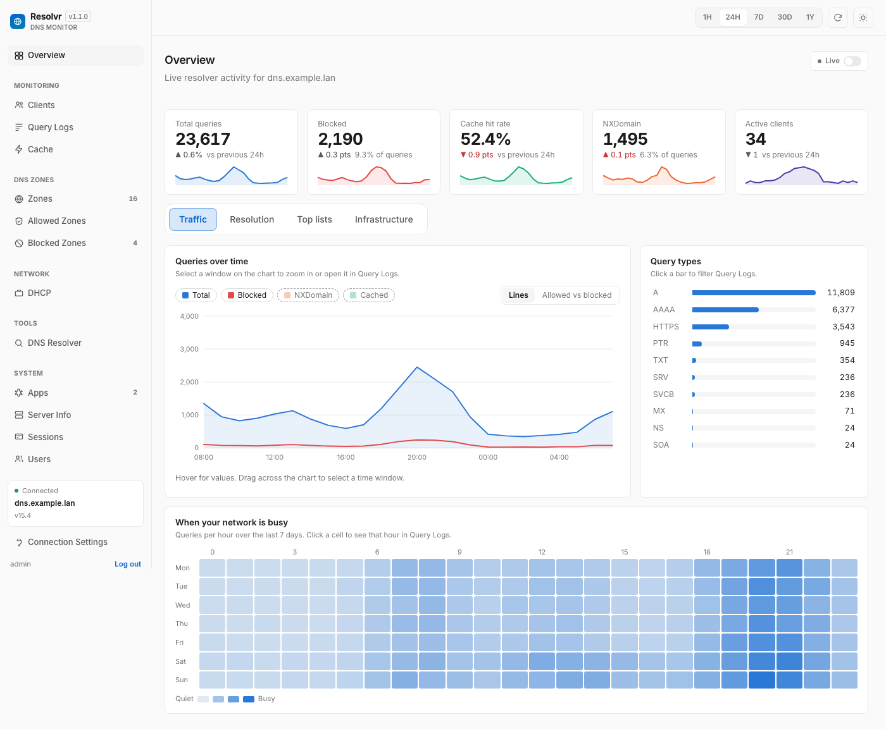

## What it does

- **Overview in four tabs**, all read from your Technitium server. Stat tiles above the tabs show change against the previous period.
  - **Traffic** — queries over time (toggle series, stack allowed vs. blocked, drag to select a window and open it in Query Logs), query types, and a 7-day "when is my network busy" heatmap.
  - **Resolution** — where answers come from (cache, upstream, blocked, authoritative), response outcomes, upstream response time, and a flow diagram of how queries get resolved.
  - **Top lists** — top clients, top domains, top blocked domains.
  - **Infrastructure** — DHCP scope usage, zones by type, cache size over time.

  Every chart is clickable and jumps to Query Logs filtered to what you clicked.
- **Clients** — pick any device and see its queries, block rate, DHCP lease, activity, top and blocked domains, protocols and latest queries. A traffic-share bar and a recent-activity grid show who is busy; search, filter (heavy blocking, rate limited, new, quiet) and sort the list.
- **Query Logs** with real filtering — client IP, query name, response type, protocol, RCODE, record type, and a time window — plus a per-host "allowed vs. blocked" breakdown, CSV export and a live-tail toggle.
- **Blocked Zones** — a status card showing when the block lists were last updated and when the next update is, with an **Update now** button and a history of how many domains the lists held after each refresh. Below it, three tabs: **Feeds** (add, remove, reorder and group the feeds you subscribe to, with one save bar), **Your domains** (a searchable list of domains you block yourself, with paste-a-list and undo), and **Check a domain** (asks your server whether a name is blocked, and which feed blocked it).
- **Its own users and roles** — Admins can manage users, edit the Technitium connection, and use the handful of mutating actions below; Viewers get full read access to every monitoring page and nothing else.
- **A set of deliberate, narrow admin actions** on top of an otherwise read-only design: flush the DNS cache, force a block-list update, add/remove a blocked domain, edit block list feeds, revoke a stale session, uninstall an app, and manage simple host-to-IP mappings (create a zone, add an A/AAAA record, delete the zone — the same pattern as AdGuard Home's "DNS rewrites"). Each one is a single hardcoded call to a specific Technitium endpoint, gated to the admin role, and confirmed before it runs — never a general write proxy.

Resolvr never touches anything on your DNS server beyond that short, explicit list of admin actions — every other page only reads. A Viewer account can't use any of them.

The query-based panels (Resolution, Clients, Query Logs) need one of Technitium's query-logging apps installed on the server; the page tells you when it is missing. A few small things are remembered in your browser rather than on the server: the open tab, the block-list and cache history, and which clients you have already seen.

## Screenshots

| | |
|---|---|
| 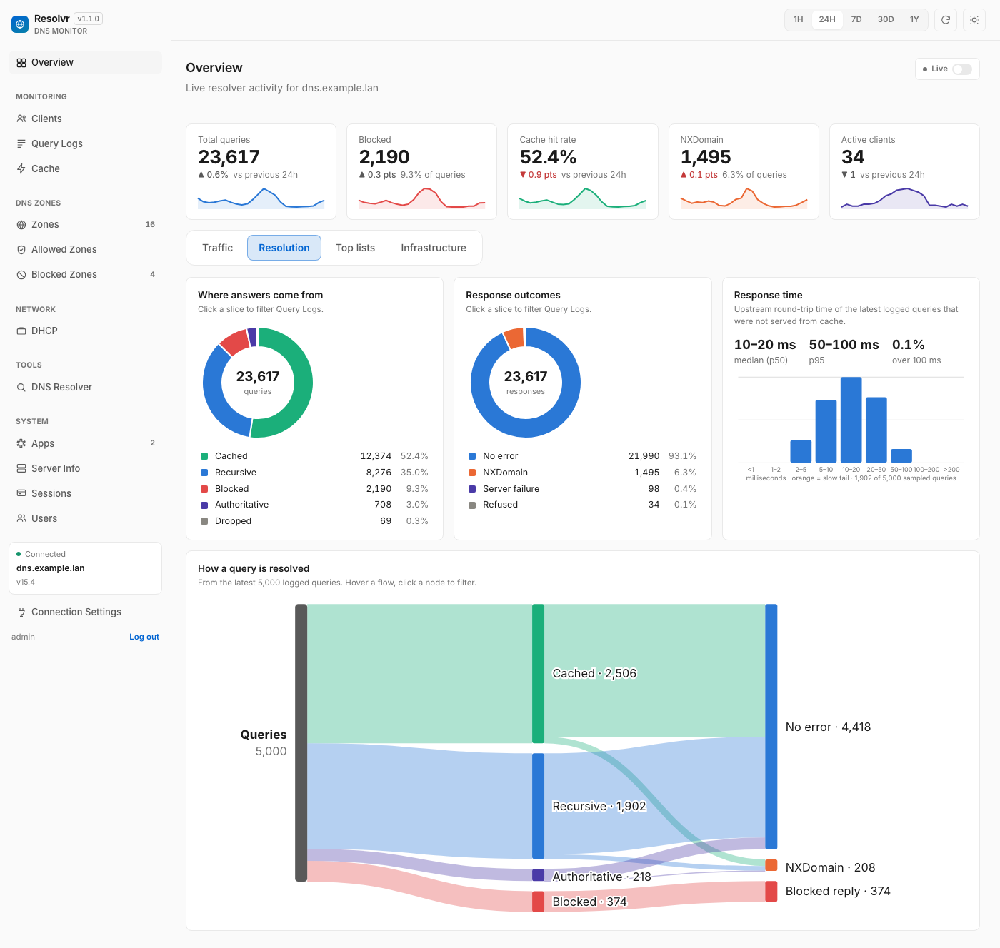 | 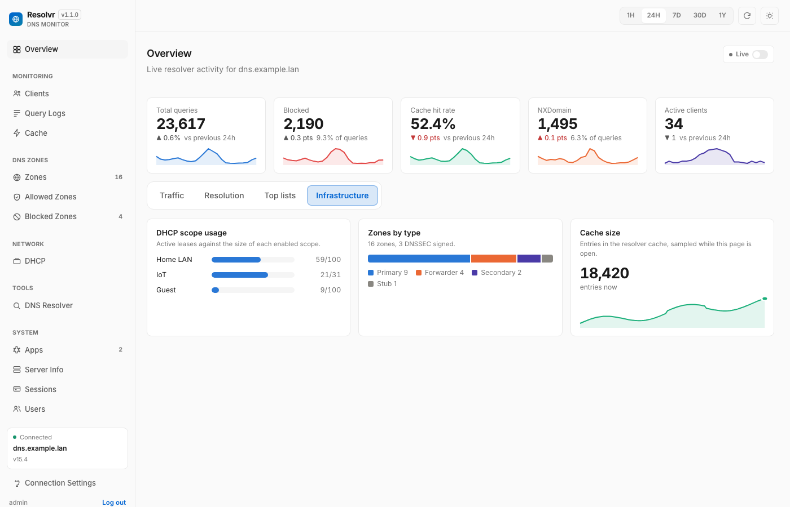 |
| 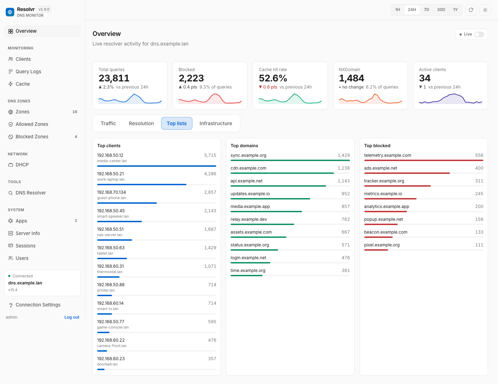 | 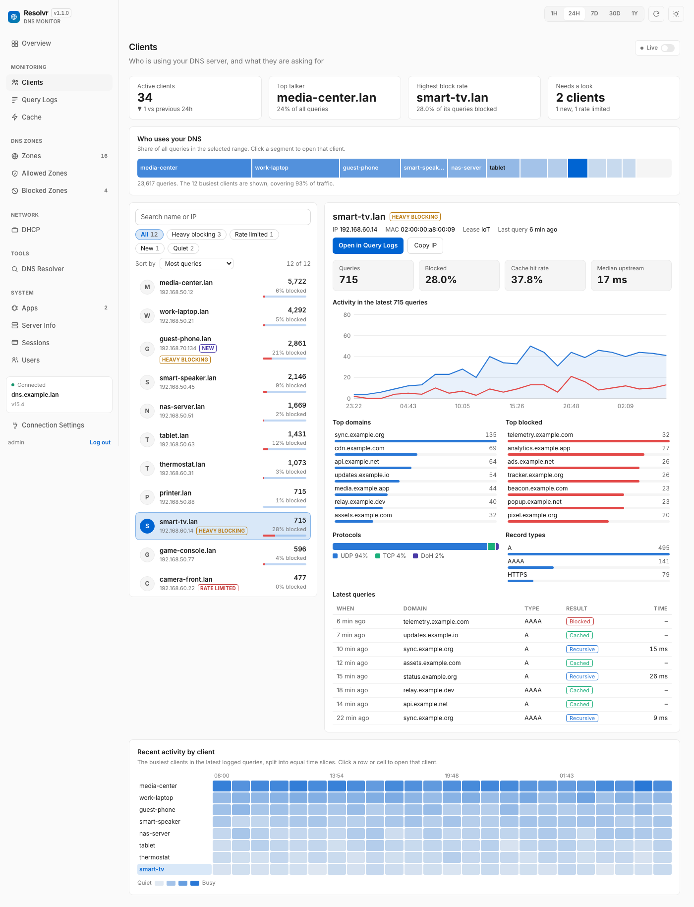 |
| 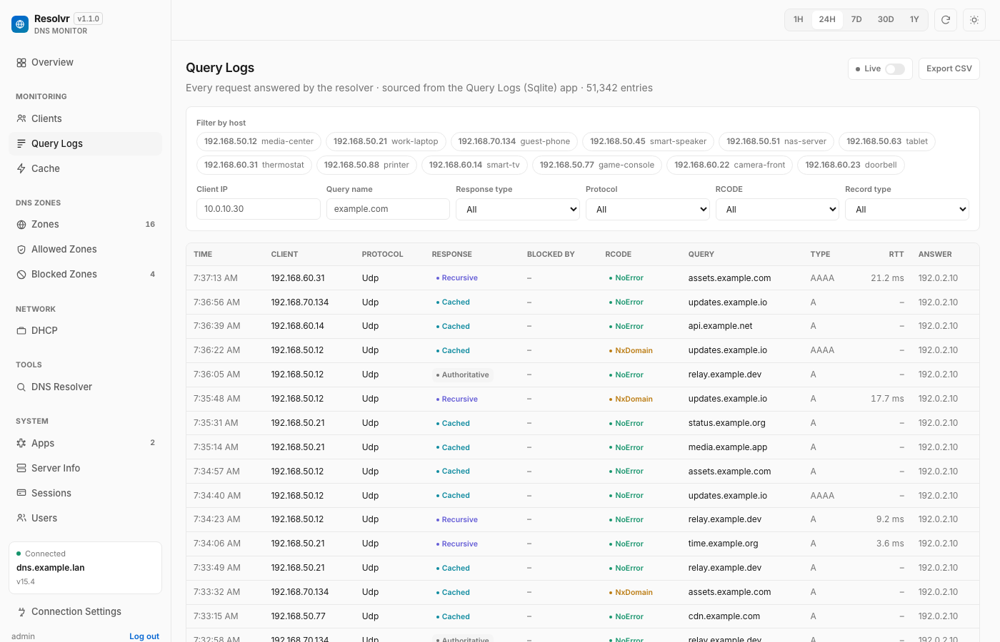 | 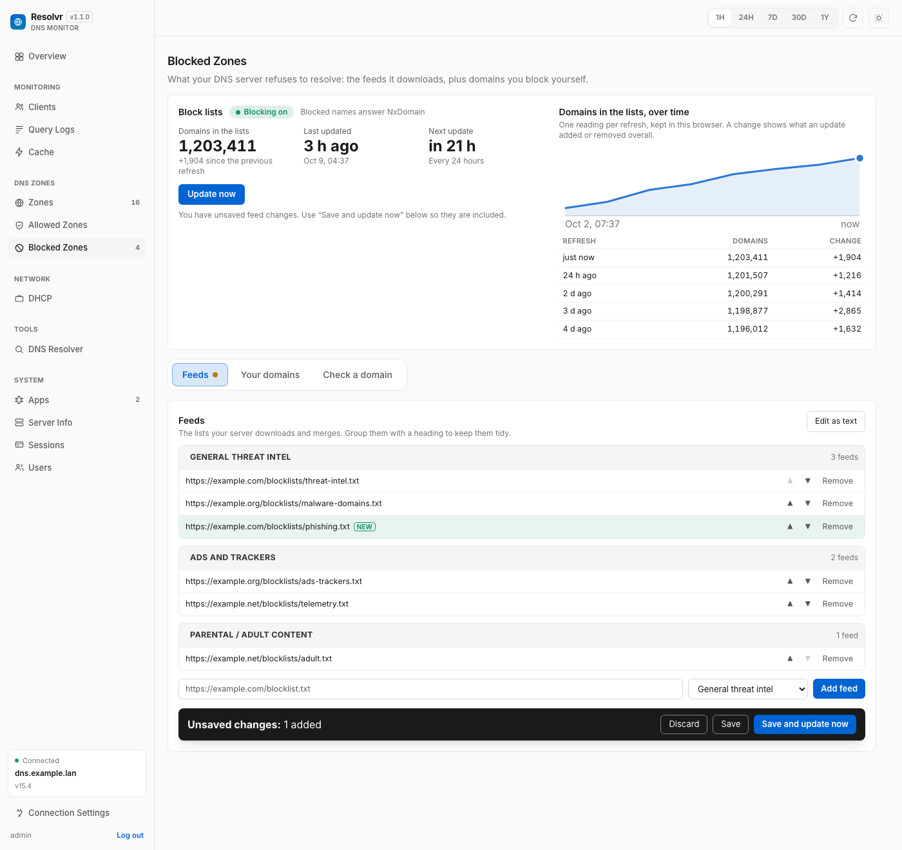 |
| 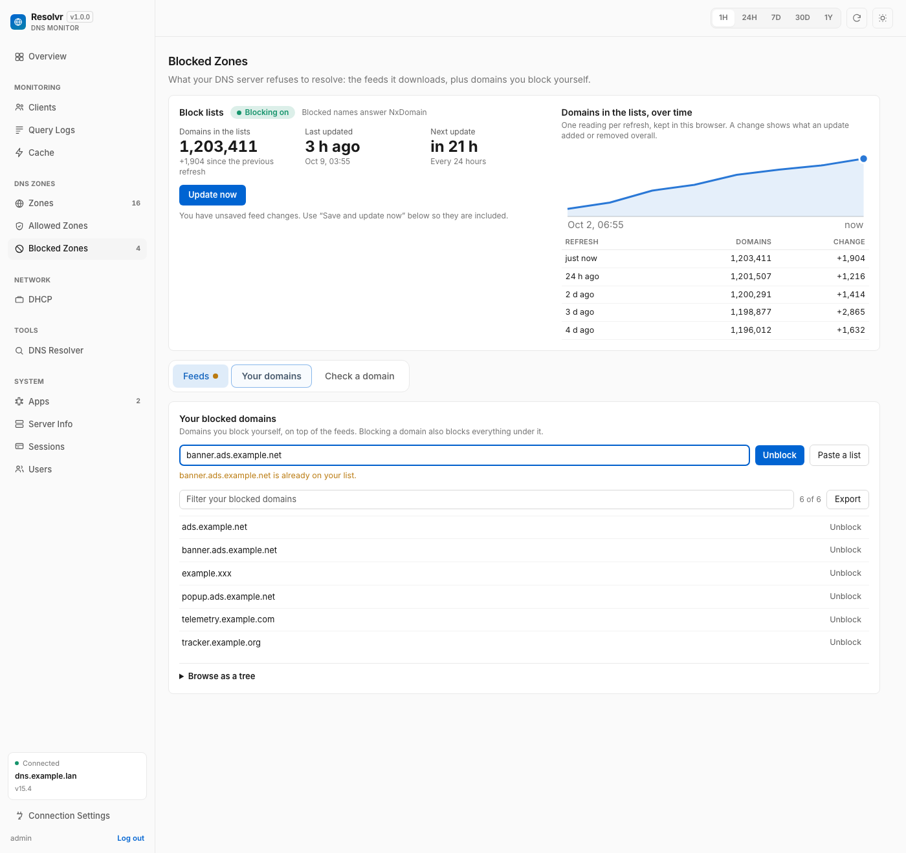 | 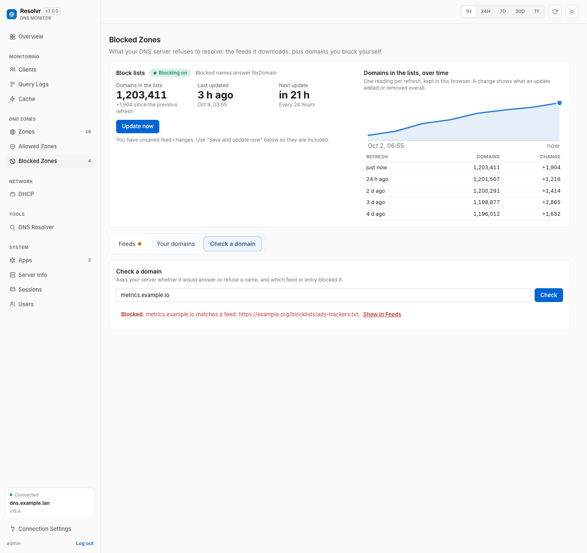 |
| 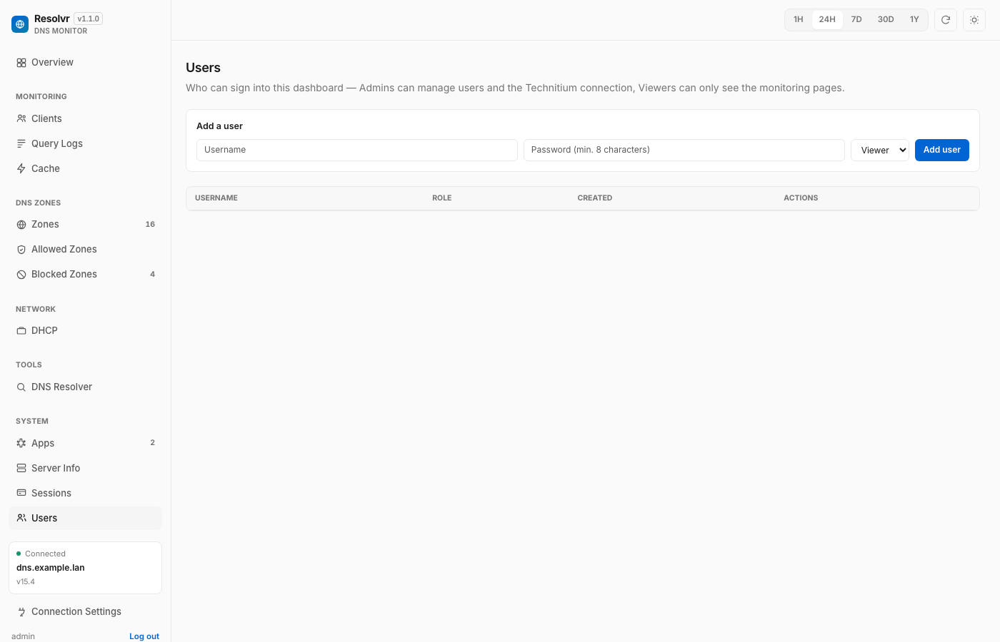 | 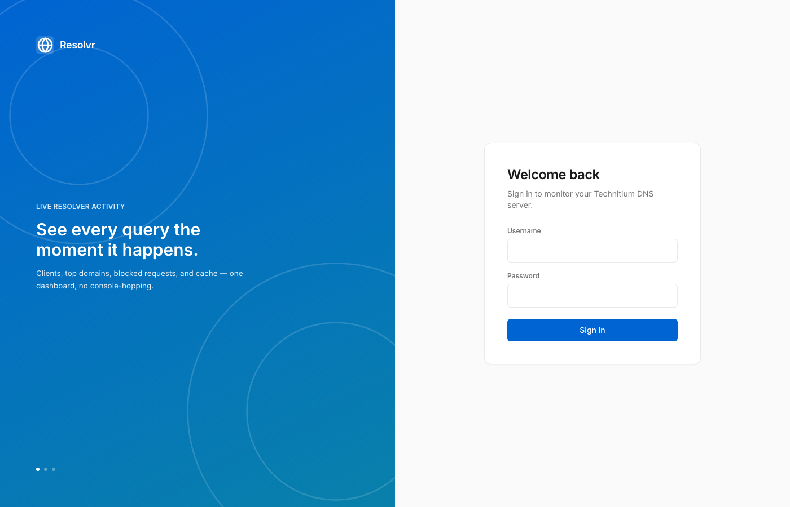 |

The screenshots use made-up data: private-range IPs, generic device names, and `example.*` domains.

## Architecture

Two small services:

- **`backend/`** — a stateless Node/Express proxy in front of Technitium's HTTP API (Technitium sends no CORS headers, so the browser can't call it directly), plus a small SQLite database (`better-sqlite3`) holding Resolvr's own users, sessions, and the shared Technitium connection config. The main proxy (`/api/technitium/*`) only forwards `GET` requests on a hardcoded allowlist of read endpoints — nothing else gets through, regardless of what a client sends. Separately, a handful of admin-only action routes (`/api/actions/*`) each call exactly one specific mutating Technitium endpoint — flush cache, force a block-list update, add/remove a blocked domain, edit block list source URLs, revoke a session, uninstall an app, create/delete a zone, add a record — gated by role, never a general write proxy.
- **`frontend/`** — a Vue 3 + TypeScript + Vite SPA, served as static files in production.

```
Browser → frontend (static SPA) → backend (Express) → Technitium DNS Server
```

## Deploying

### Option 1: Docker with pre-built images (fastest — no cloning)

Pre-built images are published to GHCR on every release: `ghcr.io/bassem-elsodany/resolvr-backend` and `ghcr.io/bassem-elsodany/resolvr-frontend` (tagged `latest` and by version). Save this as `docker-compose.yml` anywhere and run it — no clone, no build (also available as [`docker/docker-compose.prebuilt.yml`](docker/docker-compose.prebuilt.yml) in this repo):

Images are multi-arch (`linux/amd64` and `linux/arm64` — Raspberry Pi included).

```yaml
services:
  backend:
    image: ghcr.io/bassem-elsodany/resolvr-backend:latest
    pull_policy: always   # always check the registry, don't reuse a stale local image
    ports:
      - "8787:8787"
    environment:
      - PORT=8787
      - DB_PATH=/app/data/resolvr.db
      - ADMIN_USERNAME=admin
      - ADMIN_PASSWORD=change-me-on-first-login
      - VIEWER_USERNAME=viewer
      - VIEWER_PASSWORD=change-me-on-first-login
      # - COOKIE_SECURE=true   # only if this is behind your own TLS proxy
    volumes:
      - resolvr-data:/app/data
    restart: unless-stopped

  frontend:
    image: ghcr.io/bassem-elsodany/resolvr-frontend:latest
    pull_policy: always
    ports:
      - "8080:80"
    depends_on:
      - backend
    restart: unless-stopped

volumes:
  resolvr-data:
```

With `pull_policy: always`, `docker compose up -d` re-checks the registry itself on every run — no need to remember `docker compose pull` separately. If you don't set this, Docker silently keeps running whatever image is already cached locally under the `latest` tag, even after a new one is published.

```bash
docker compose up -d
```

Then open **http://\<this-machine's-address\>:8080** — `localhost` if you're on the same machine, or its LAN IP/hostname from anywhere else (e.g. a Raspberry Pi reached from your laptop) — and sign in with one of the seeded accounts below (see [Configuration](#configuration) — **change these passwords immediately** from the Users page). No `VITE_BACKEND_URL` or `FRONTEND_ORIGIN` configuration needed: the frontend targets whatever host served the page on port 8787, and the backend accepts whatever origin the browser is actually using — both work correctly no matter which address you use to reach the UI.

### Option 2: Docker, building from source

Same result as Option 1, but builds both images locally instead of pulling them — useful if you want to modify the code, or need a fixed `VITE_BACKEND_URL`/`FRONTEND_ORIGIN` for a split-host setup.

**Requirements:** Docker and Docker Compose.

```bash
cd technitium-dashboard   # this repo
docker compose -f docker/docker-compose.yml up -d --build
```

To stop it: `docker compose -f docker/docker-compose.yml down` (add `-v` only if you also want to delete the persisted database).

#### Docker environment variables

Set these under the `backend` service (in `docker/docker-compose.yml`, or the pre-built-image compose file above) before deploying anywhere beyond your own machine:

| Variable | Default | Purpose |
|---|---|---|
| `ADMIN_USERNAME` | `admin` | Seeded as the first admin account on first boot only. |
| `ADMIN_PASSWORD` | `change-me-on-first-login` | **Change this.** Only used the very first time the database is empty — changing it later has no effect on an existing install; change the password from the Users page instead. |
| `VIEWER_USERNAME` | `viewer` | Optional — seeded as a read-only account alongside the admin above, on first boot only. Remove both `VIEWER_*` variables if you don't want one created. |
| `VIEWER_PASSWORD` | `change-me-on-first-login` | **Change this too**, same first-boot-only caveat as `ADMIN_PASSWORD`. |
| `FRONTEND_ORIGIN` | *(unset)* | Optional. Unset means the backend accepts whatever origin the browser is actually using — correct by default since this app has no single fixed frontend address (localhost, a LAN IP, a hostname — all work). Set one exact origin here only to lock the app down to a single known address; anything else will then be rejected. |
| `COOKIE_SECURE` | *(unset, insecure)* | Optional. Unset (or anything other than `true`) means the session cookie is **not** marked `Secure` — required for login to work at all when this app is reached over plain HTTP, which is the normal case for a self-hosted LAN tool. Set to `true` only if you've put this behind your own TLS-terminating reverse proxy; a `Secure` cookie is silently dropped by the browser over plain HTTP, which looks exactly like "login succeeds but every next request says Not authenticated." |
| `DB_PATH` | `/app/data/resolvr.db` | Where the SQLite file lives, on the `resolvr-data` named volume so it survives rebuilds. |

The frontend image also takes a build argument, `VITE_BACKEND_URL`, left unset by default — the app then targets whatever host served the page, on port 8787, at runtime in the browser. Set it explicitly only for a split-host setup where the backend isn't reachable at that address (it has to be the backend's URL as seen from the *browser*, not from inside the frontend container, since Vite bakes it into the static build at build time).

If you're instead putting the frontend behind your own reverse proxy — one that forwards `/api` to the backend somewhere other than "this address, port 8787" (e.g. to the backend on the same public origin, no port) — set the `BACKEND_URL` *container* environment variable on the `frontend` service instead:

```yaml
    environment:
      - BACKEND_URL=https://resolvr.example.com
```

Unlike `VITE_BACKEND_URL`, this is read at container start (see `docker/docker-entrypoint.sh`), so it works with the pre-built image too — no rebuild needed, and it can differ per deployment.

### Option 3: a single container

The API can also serve the web app, so Resolvr runs as one container instead of two. This is the image the Home Assistant add-on uses.

```bash
curl -O https://raw.githubusercontent.com/bassem-elsodany/resolvr-dns-dashboard/main/docker/docker-compose.single.yml
docker compose -f docker-compose.single.yml up -d
```

Open `http://<this-machine>:8080` and sign in with the account in the file (change the passwords). The image is `ghcr.io/bassem-elsodany/resolvr` (amd64 and arm64), tagged with each release version.

### Home Assistant add-on

Resolvr also runs as a Home Assistant add-on, in the sidebar. It uses your Home Assistant sign-in, so there is no separate login, and the Technitium address and API token are set in the add-on's Configuration tab. Add `https://github.com/bassem-elsodany/homelab-ha-addons` as an add-on repository (Settings → Add-ons → Add-on Store → ⋮ → Repositories), then install **Resolvr**. See the [add-on documentation](https://github.com/bassem-elsodany/homelab-ha-addons/blob/main/resolvr/DOCS.md).

### Option 4: Standalone (without Docker)

Useful for local development, or if you'd rather run the two services with your own process manager (systemd, pm2, etc.) than with Docker.

**Requirements:** Node.js 24+.

**1. Backend**

```bash
cd backend
npm install
npm run build
PORT=8787 \
FRONTEND_ORIGIN=http://localhost:5173 \
ADMIN_USERNAME=admin \
ADMIN_PASSWORD=change-me-on-first-login \
VIEWER_USERNAME=viewer \
VIEWER_PASSWORD=change-me-on-first-login \
DB_PATH=./data/resolvr.db \
npm start
```

(For local development instead of a production run, use `npm run dev` — it watches for changes.)

**2. Frontend**

In a second terminal:

```bash
cd frontend
npm install
echo "VITE_BACKEND_URL=http://localhost:8787" > .env.local
npm run dev
```

Open the URL Vite prints (typically **http://localhost:5173**).

To build the frontend for a static production deploy instead of running the dev server:

```bash
npm run build   # outputs to frontend/dist/ — serve it with any static file host
```

Whatever serves `frontend/dist/` must be reachable at the origin you set as `FRONTEND_ORIGIN` on the backend, and the build must have been made with `VITE_BACKEND_URL` pointing at wherever the backend is reachable from the browser.

## Configuration

On first boot (empty database), the backend seeds these accounts from the environment variables above — both are real, working logins on a fresh install:

| Username | Password | Role | Can do |
|---|---|---|---|
| `admin` | `change-me-on-first-login` | Admin | Everything — manage users, edit the Technitium connection, and the handful of mutating actions (flush cache, block-list updates, etc.) |
| `viewer` | `change-me-on-first-login` | Viewer | Every monitoring page, read-only. No Users, no Connection Settings, no mutating actions. |

**Change both passwords immediately** — from the Users page once signed in as `admin`. The viewer account is optional (see `VIEWER_USERNAME`/`VIEWER_PASSWORD` above); omit those two variables if you don't want one seeded.

After signing in:

1. Go to **Connection Settings** (admin only) and point Resolvr at your Technitium server — its base URL and an API token (create one under Technitium's own Administration → Sessions → Create Token, or use a full login token). This is validated against the real server before it's saved, and shared by everyone who signs into this Resolvr instance.
2. Go to **Users** to change both seeded passwords and add any other accounts — `admin` (full access) or `viewer` (read-only).

## Development

Both services have their own test suite and build:

```bash
cd backend && npm test && npm run build
cd frontend && npm test && npm run build
```

Type-checking runs as part of `npm run build` in both.

## License

[MIT](LICENSE)
